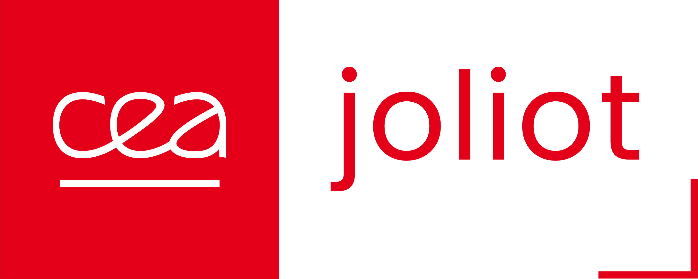

# Community & Contact

/// html | div.grid.cards

- :globe_with_meridians:{ .lg .middle } __Pulseq Community__

    ---

    Join the global Pulseq development community  
    [:octicons-arrow-right-24: Pulseq GitHub](https://github.com/pulseq/pulseq)

- :people_holding_hands:{ .lg .middle } __Philips MR-Paradise__

    ---

    Connect with colleagues using Philips scanners  
    [:octicons-arrow-right-24: MR-Paradise Forum](https://community.mr-paradise.com/)

- :book:{ .lg .middle } __Documentation__

    ---

    Complete codebase, and technical documentation  
    [:octicons-arrow-right-24: Interpreter GitHub](https://github.com/philips-internal/MRParadisePulseq)

///

## Open Source Contributions

While the full source code cannot be open-sourced - the pTx-Pulseq interpreter is built on open-source principles.
We welcome contributions:

- __Bug reports:__ Help us improve stability and compatibility
- __Code contributions:__ Submit pull requests for review
- __Feature requests:__ Suggest new capabilities and improvements  
- __Documentation:__ Improve guides and examples
- __Testing:__ Validate sequences on different scanner configurations

__Contributing guidelines:__
  See our [GitHub repository](https://github.com/philips-internal/MRParadisePulseq/) for detailed contribution instructions.

---

## Getting Help

### :rocket: Quick Questions

Depending on the _source_ of the question of problem, you can reach out for:

- Philips-specific interpreter: [__Philips GitHub__](https://github.com/philips-internal/MRParadisePulseq/issues)
- Pulseq standard, C++ reader, or MATLAB library: [__Pulseq GitHub__](https://github.com/pulseq/pulseq)
- Python library: [__PyPulseq GitHub__](https://github.com/imr-framework/pypulseq)

/// admonition | Direct contact
    type: info

:fontawesome-solid-user-pen: Your idea, problem, question or suggestion could help others,
so please use [the above](#getting-help) for them.
///

In case you need to contact the lead developer of the Philips interpreter directly:

/// html | div.grid.center
{ width="75%" }

/// html | div

### Thomas Roos

__Lead Developer & PhD Candidate__  
UMC Utrecht, Netherlands  
High Field MRI Research Group  
📧 <t.h.m.roos-2@umcutrecht.nl>
///
///

---

# Acknowledgments

This work was supported by our partners:

/// html | div.logo-grid
/// html | div.logo-item

[__CEA NeuroSpin__](https://joliot.cea.fr/drf/joliot/en/research/NeuroSpin)
_PASTeUR pulses and pTx expertise_
///
/// html | div.logo-item

[__Philips Healthcare__](https://www.philips.com/healthcare/diagnostic-imaging/magnetic-resonance-imaging)
_Technical partnership and scanner access_
///
/// html | div.logo-item

[__Dutch Research Council__](https://www.nwo.nl/en/calls/nwo-talent-programme)
_Funding support for research and development_
///
///

We thank the global Pulseq community for creating the foundation that makes vendor-neutral sequence development possible.

/// html | div.cta-section

## Ready to get started?

Get _inspired_ by the examples, then _follow along_ with our quickstart guide!

[:rocket: Get Started](quickstart.md){ .md-button .md-button--primary .md-button--animated }
[:camera: View Examples](examples.md){ .md-button .md-button--animated }

///
