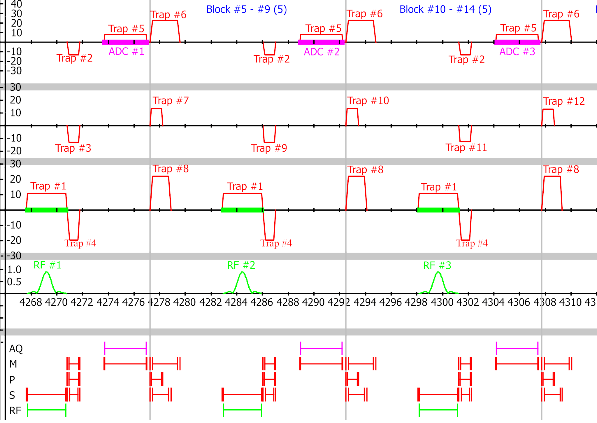
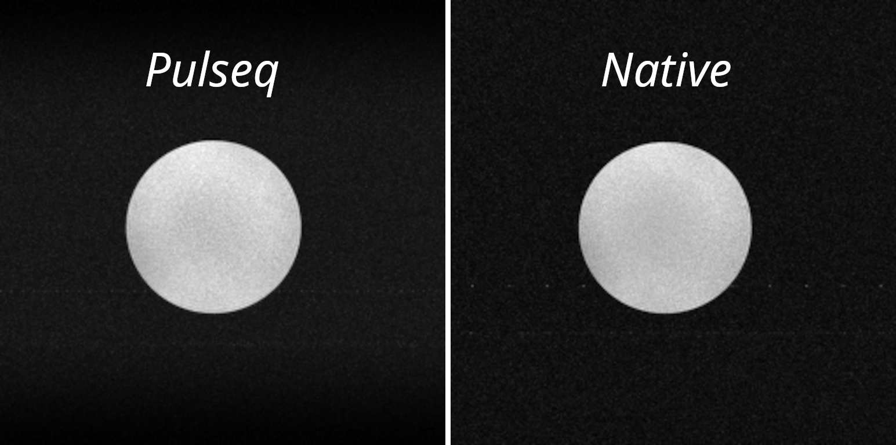
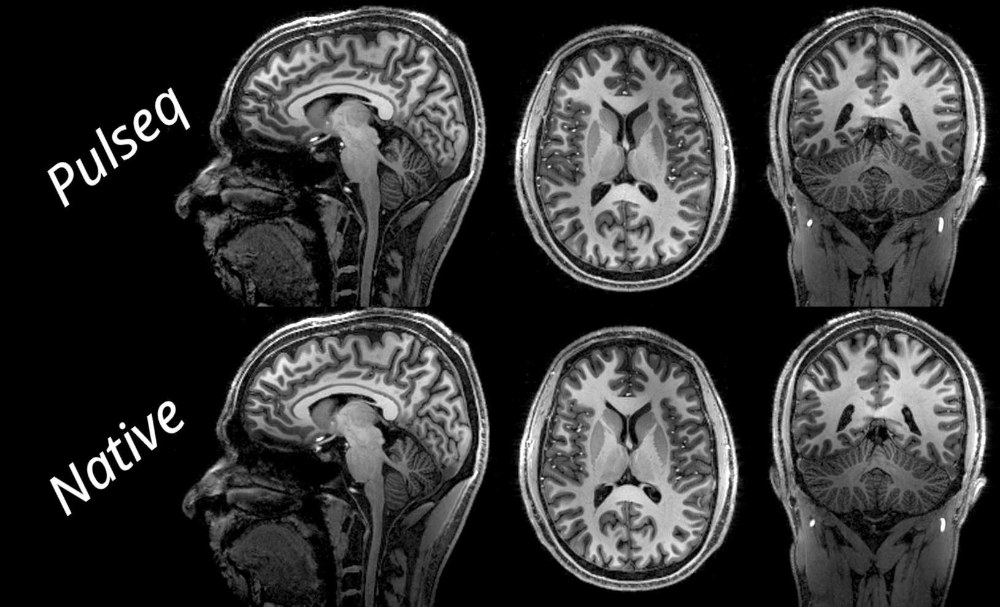
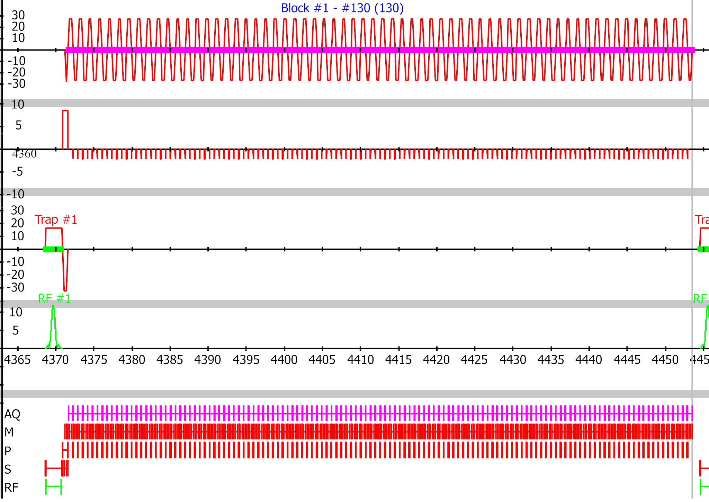
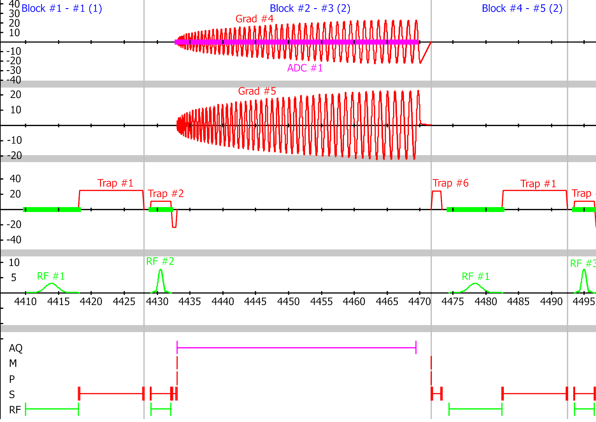
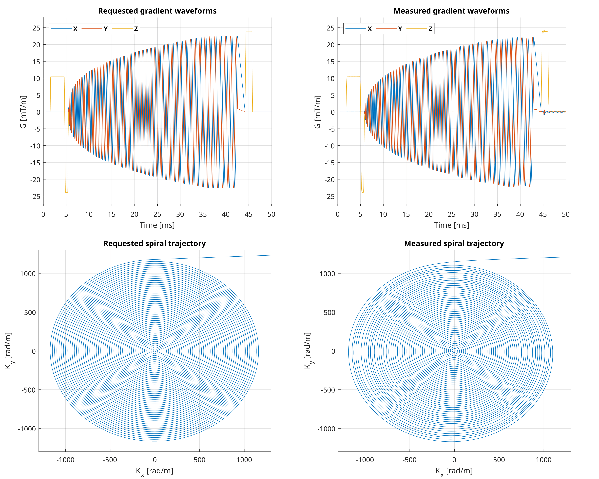
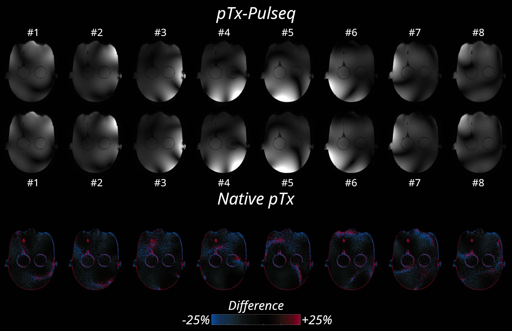
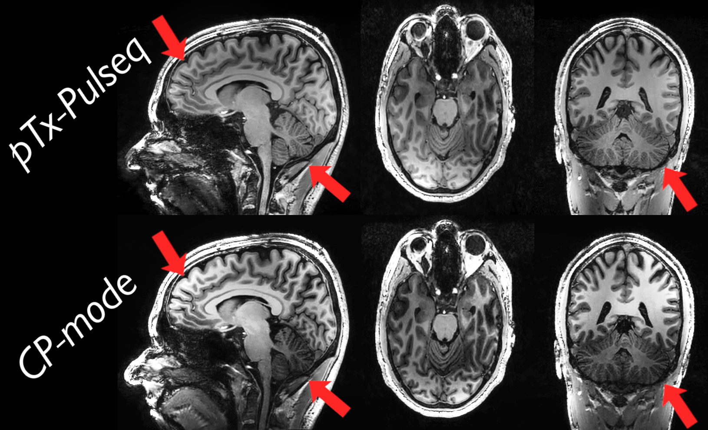

# Sequence Examples

## Basic Sequences

### Gradient Echo (GRE)

Fast gradient echo sequence with excellent SNR. Great foundation for more complex sequences.

/// html | div.grid.center

/// caption
Pulse sequence diagram from spectrometer simulation
///

/// html | div

/// caption
Pulseq and Philips (parameter-matched) phantom scans
///
[:pencil: MATLAB](https://pulseq.github.io/writeGradientEcho.html){ .md-button }
[:pencil: Python](https://github.com/imr-framework/pypulseq/blob/master/examples/scripts/write_gre.py){ .md-button }
[:arrow_down: .seq file](assets/seq/test_gre.seq){ .md-button .md-button--primary }
///
///

---

### Magnetization prepared rapid gradient-echo (MP-RAGE)

/// html | div.grid.center
/// html | div
MP-RAGE is a 3D sequence that integrates an inversion pulse for T1-weighted imaging.  
  
[:pencil: MATLAB](https://github.com/pulseq/pulseq/blob/master/matlab/demoSeq/writeMPRAGE.m){ .md-button }
[:pencil: Python](https://github.com/imr-framework/pypulseq/blob/master/examples/scripts/write_mprage.py){ .md-button }
  
[:arrow_down: .seq file](assets/seq/mprage_gt_noFear3_TE3.seq){ .md-button .md-button--primary }
///

/// html | div
{ loading=lazy }
/// caption
Pulseq and Philips (parameter-matched) MP-RAGE head scans
///
///
///

---

### Echo Planar Imaging (EPI)

EPI sequences allow for ultra-fast imaging.
This readout is essential in functional imaging (fMRI) and diffusion (DWI & DTI) imaging studies.

/// html | div.grid.center

/// caption
Pulse sequence diagram from spectrometer simulation
///

/// html | div
{ width="400" }
/// caption
Animation of EPI phantom scan
///
[:pencil: MATLAB](https://pulseq.github.io/writeEpi.html){ .md-button }
[:pencil: Python](https://github.com/imr-framework/pypulseq/blob/master/examples/scripts/write_epi.py){ .md-button }
[:arrow_down: .seq file](assets/seq/1x128EPI_rs_noFS_2ovs_ph.seq){ .md-button .md-button--primary }
///
///

---

### Spiral Imaging

Spiral readouts do not sample k-space in a Cartesian grid.
While reconstruction can be harder, spiral readouts enable rapid imaging.
The gradient waveforms are measured by a Skope fieldcamera, and closely matching what is requested in the `.seq` file.

/// html | div.grid.center

/// caption
Pulse sequence diagram of spiral sequence
///

/// html | div
{ loading=lazy }
/// caption
Requested and measured k-space and gradient trajectories.
///
[:pencil: MATLAB](https://pulseq.github.io/writeSpiral.html){ .md-button }
[:pencil: Python](https://github.com/imr-framework/pypulseq/blob/master/examples/scripts/write_spiral.py){ .md-button }
[:arrow_down: .seq file](assets/seq/test_spiral.seq){ .md-button .md-button--primary }
///
///

---

## Advanced sequences

### Parallel Transmission (pTx)

Parallel transmission (pTx) sequences can independently control multiple transmit (Tx) channels.
This allows for advanced RF pulse design, such as B1 shimming, and improved SAR management.  

___:octicons-arrow-right-24: [More info on the Features page](features.md#parallel-transmission-ptx)___

#### Single transmit channel GRE

/// html | div.grid.center
This simple example demonstrates how pTx-Pulseq sequences can be created.
It acquires the same slice multiple times, each with only one Tx channel active.

[:pencil: MATLAB code](https://github.com/Roosted7/ptx-pulseq/blob/da510e1785cd61f548d308e390ee444cea0a53be/matlab/demoSeq/writeGradientEcho_pTx_SingleTx.m){ .md-button }
[:arrow_down: Download .seq file](assets/seq/gre2d_pTxSingleChan_8Tx.seq){ .md-button .md-button--primary }
///

/// html | div.grid
{ loading=lazy }
/// caption
GRE slices each acquired with 1 Tx channel
///

/// tab | MATLAB code

```matlab
% Each slice is acquired with a single Tx channel
tx_pattern = eye_tx;

% Prepare the RF pulses
ptx = {}; id = {}; shapeids = {};
for i = 1:size(tx_pattern, 1)

    % Copy the non-pTx RF pulse
    ptx{i} = rf;

    % Apply the Tx pattern to the RF signal
    ptx{i}.signal = reshape(rf.signal' .* tx_pattern(i, :), 1, []);
    % And repeat the time vector with the number of Tx channels
    ptx{i}.t = repmat(rf.t, 1, num_tx);
end
```

///
/// tab | Python code

```python
# Each slice is acquired with a single Tx channel
tx_pattern = np.eye(num_tx)

# Prepare the RF pulses
ptx = []
for i in range(num_tx):
    # Copy the non-pTx RF pulse
    rf_ptx = rf.copy()

    # Apply the Tx pattern to the RF signal
    rf_ptx.signal = np.reshape(rf.signal * tx_pattern[i, :], (1, -1))
    # And repeat the time vector with the number of Tx channels
    rf_ptx.t = np.tile(rf.t, (1, num_tx))

    ptx.append(rf_ptx)
```

///
///

---

### Hybrid Mode

#### PASTeUR Universal Pulse in a Philips MP-RAGE

This example demonstrates how a pTx-Pulseq sequence, containing an excitation pulse from the PASTeUR Universal Pulse library,
can be merged with a native Philips MP-RAGE sequence.

Why reinvent the wheel, if you just need a small change? ___:octicons-arrow-right-24: [More info on the Features page](features.md#hybrid-mode)___


/// html | div.grid

/// caption
Merging of Pulseq and native sequence into a hybrid sequence
///

/// html | div
{ loading=lazy }
/// caption
Improved $\mathcal{\tilde{B}}_1^{(+)}$ homogeneity with PASTeUR Universal Pulse  
using a hybrid pTx-Pulseq sequence
///
///
///

---

## Using these sequences

Ready to try these features?
Check out our [quickstart guide](quickstart.md) or explore the [features](features.md) for more information.
