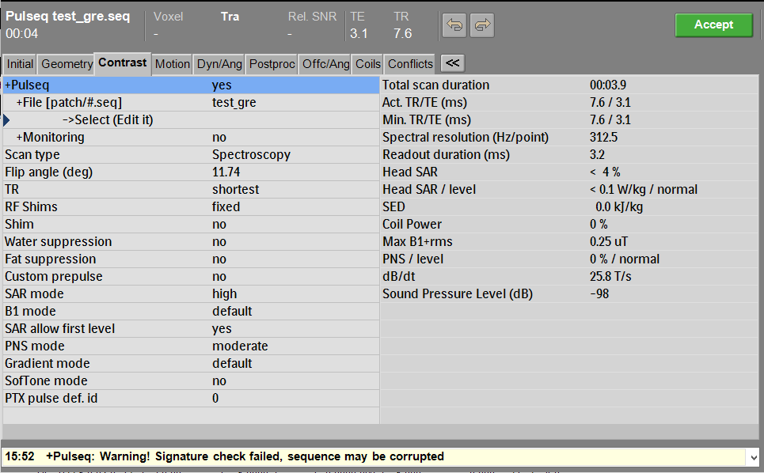

# Key Features

## Design Philosophy

The interpreter is built around three core principles:

/// html | div.grid.cards

- :dart:{ .lg .middle } __Accurate__

    ---

    If it runs, it is _exactly_ as you requested  
  
    _:octicons-arrow-down-24: [More details](#accuracy)_

- :jigsaw:{ .lg .middle } __Compatible__

    ---

    Runs almost _any_ Pulseq file, even if they are made for other vendors  
  
    _:octicons-arrow-down-24: [More details](#compatibility)_

- :gear:{ .lg .middle } __Flexible__

    ---

    Simple by default, while powerful & advanced if needed  
  
    _:octicons-arrow-down-24: [More details](#flexibility)_

///

---

## Accuracy

> If it runs, it is _exactly_ as you requested

- :x: __Conversion__  
The interpreter directly runs `.seq` files - no extra steps, no scripts, or files are required.  
[:octicons-arrow-right-24: Quickstart Guide](quickstart.md)

- :x: __Sequence detection__  
There is no detection of currently common sequence types.  
If you're building something completely new, it will run - without updating the compiler. 

### Interpreter architecture

When running conventional full Pulseq sequences, a Philips _"Spectroscopy"_ sequence is started.
This sequence is treated as dummy sequence, as the interpreter modifies the sequence to match the Pulseq sequence block-by-block.  
While Philips sequences are usually built with clever re-use of objects and sequence building blocks,
 this approach of running Pulseq offers the full flexibility to run any type of sequence!


/// caption
Overview of the interpreter architecture
///

---

## Compatibility

> Runs almost _any_ Pulseq file, even if they are made for other vendors

As Philips is one of the later vendors to gain Pulseq support, there are already lots of sequences available online.  
Therefore, this interpreter is designed to run as much [existing sequences](examples.md) as possible!

/// details | Hardware compatibility
    type: danger

While the interpreter and many sequences are free... Pulseq is not free a hardware specification upgrade!  
Sequences designed for another scanner may be incompatible with yours. For example:

- gradient specs (strength, slew rate)
- max B1+
- sound levels
- PNS

and other aspects could be more or less limiting than other systems...
///

This compatibility is achieved through using the existing C++ reference interpreter from Pulseq itself - and extra optimizatons:

### Blocks & delays

The [Pulseq specification](assets/specification.pdf) lists the duration of blocks as an _integer_ of the `BlockDurationRaster`.
Similarly, the delays of events are specified as $\mu$s, again in whole integers.  
During testing with Philips native dwell times, we found the MATLAB library to generate `.seq` files with non-integer delays.
As the Philips platform has no $\mu$s reqirement, the interpreter was modified to support floating-point delays and durations.

#### Block merging

MRI scanners commonly need time to switch the RF chain between transmit and receive states (tuning and detuning coils).
RF pulses and ADC events therefore need extra time before and/or after them.  
  
While the Pulseq libraries support designing sequences around
 these (using the so-called `DeadTime` and `RingdownTime` system options) - this interpreter prevents their need all together.  
By automatically merging multiple Pulseq blocks into 1 large block, the requirement of extra time is removed:


/// caption
Pulse sequence diagram of a diffusion scan with EPI readout
///

> Block #54 - #57 (4) [@1 ms]

Shows that 4 blocks are merged, from `#54` to `#57`.
And the `[@1ms]` means that set of blocks started at 1ms (after the gray line),
with some gradients overflowing, to create more time for the preceeding RF pulse.

### Raster times

#### Gradients _(GR)_

The raster times for the three different types of gradients in Pulseq are handled as:
<!-- markdownlint-disable MD001 MD013 -->
| Gradient Type              | Descriptor                            | Mapping                                                                                           |
|----------------------------|---------------------------------------|---------------------------------------------------------------------------------------------------|
| __Trapezodial__            | `[TRAP]`                              | Native Trapezodial `GR` objects. All timings are supported, without requiring any grid-allignment |
| __Extended Trapezodial__   | `[GRADIENTS]` with time waveform      | Split up across multiple native `GR` objects                                                      |
| __Arbitrary__              | `[GRADIENTS]` without time waveform   | Native sampled gradients - and resampled if needed                                                |
<!-- markdownlint-enable MD001 MD013 -->

#### RF pulses _(RF)_

The interpreter is able to accomodate different raster times through either:

1. Changing the _hardware_ dwell time
2. Using the native flexibility, and its support for interpolation _(recommended)_

---

## Flexibility

> Simple by default, while powerful & advanced if needed

How simple? See the [:octicons-arrow-right-24: Quickstart Guide](quickstart.md)

### Extensions

On top of supporting conventional Pulseq sequences, the interpreters is already extended with two novel features.

#### Parallel Transmission (pTx)

/// html | div.grid
/// html | div
On Ultra High Field (UHF) MRI systems (≥7T), scans may become inhomogenous due to the inherently higher $f_0$ frequency.  
  
Most UHF MRI scanners offer multiple transmit (Tx) channels.  
  
Each channel has its own $\mathcal{\tilde{B}}_1^{(+)}$ field, that can be used as one single.  
Or they can be used independantly, to improve the total $\mathcal{\tilde{B}}_1^{(+)}$ field.

///

/// caption
Animaton of eight 2D slices, each using one of the 8 Tx channels
///
///

By exploiting the flexibility of the Pulseq framework, we've extended it to _"pTx-Pulseq"_ that offers:

- __Per-channel waveforms:__ Individual control of all transmit channels
- __Complex waveforms:__ Full magnitude and phase control over all samples

/// html | div.grid.center


/// caption
Animation of the real-time power monitoring during a pTx sequence
///
///

pTx-Pulseq enables full dynamic pTx functionality (and also static shimming), by repeating the waveform's timepoints.
This allows the storage of multiple channels, without requiring an updated spec or breaking existing interpreters.

/// details | $B_0$ direction conversion
    type: abstract
    open: true
The direction of the main magnetic $B_0$ field (inwards vs outwards) alters the
$\mathcal{\tilde{B}}_1^{(+)}$ fields a coil produces. pTx pulses are portable across vendors, but might require
[:octicons-arrow-right-24: the conversion](https://doi.org/10.1002/mrm.30601) outlined in our paper.
///

/// details | Siemens support
    type: success
    open: true
While the mainline interpreter currently does not utilize the additional Tx channels in a pTx-Pulseq sequence,
[:octicons-arrow-right-24: Dario Bosch](https://www.kyb.tuebingen.mpg.de/person/59146/249684) implemented
pTx-Pulseq support for all Siemens UHF scanner platforms.
///

#### Hybrid mode

Besides running normal full (pTx-)Pulseq scans, the interpreter also offers a _hybrid mode_.


/// caption
Hybrid mode merges a pTx-Pulseq kT-points excitation module into a native MP-RAGE sequence
///

This hybrid mode bridges the gap between native scans, and Pulseq sequences. This allows for:

- __Best of both worlds:__ Pulseq flexibility + Native features (encoding, parameter flexbility, etc)
- __Gradual migration:__ Replace parts of existing sequences incrementally
- __Custom modules:__ Add specialized prep, excitation, or inversion modules
- __Validation:__ Compare against known-good native implementations

### Modularity

#### Code architecture


The interpreter is built around a modular architecture, with three main components.
Each component is a separate file, allowing for easy merging of new features -
as well as integration into other software releases.

#### Configuration

/// html | div.grid.center
/// html | div
There is only one parameter exposed in the examcard UI.  
This parameter enables or disables the live k-space data viewer, during the scan.  
  
During testing and development, seeing the acquired data in real-time can be useful.
To reduce the ovehead, this parameter can easily disable it.
///

///
  
The other configuration options are set by adding lines to the `bstrace.dat` file.  
These are the most important ones:

##### Log verbosity levels

/// html | div.grid
/// html | div.scroll

__`bstrace.dat` content__

/// tab | normal

```ini
 
PULSEQ log_level_normal *
PULSEQ pdf_log_level_normal *
 
```

///
/// tab | warning

```ini
 
PULSEQ log_level_warning *
PULSEQ pdf_log_level_warning *
 
```

///
/// tab | error

```ini
 
PULSEQ log_level_error *
PULSEQ pdf_log_level_error *
 
```

///
/// tab | debug low

```ini
 
PULSEQ log_level_debug_low *
PULSEQ pdf_log_level_debug_low *
 
```

///
/// tab | debug medium

```ini
 
PULSEQ log_level_debug_medium *
PULSEQ pdf_log_level_debug_medium *
 
```

///
/// tab | debug high

```ini
 
PULSEQ log_level_debug_high *
PULSEQ pdf_log_level_debug_high *
 
```

///
///

/// html | div.scroll

__Logging output__

/// tab | normal

```ini
...
+Pulseq: MSG_LEVEL = -1 (-2 to 3)
+Pulseq: Found 22 .seq files in patch folder:
+Pulseq: Opening G:\patch\test_gre.seq
...
```

///
/// tab | warning

```ini
...
+Pulseq: WARNING: signature validation failed! stored signature: 0cd0794cd9cc2205b4ed14149ef2873b; calculated hash: c6b9267dbad650817f109df9fb5194c2
+Pulseq: RF interpolation will be used, as dwell times do not match. HW is set to 16, seq file has 10 [100ns]
...
```

///
/// tab | error

```ini
...
+Pulseq: *** ERROR: Failed to read file G:\patch\test_gre.seq\shapes.seq
+Pulseq: *** ERROR Cannot load external sequence
...
```

///
/// tab | debug low

```ini
+Pulseq:   Starting! Current QSPY_par_meas = 29
+Pulseq: Start of SQ is Pulseq block #144 (zero-indexed!)
+Pulseq:      SQ::base->dur = 0.2444 [msec]
+Pulseq: Processing block #144 (#145 in .seq)
+Pulseq:    SQ::base->dur + 4.61 [msec] => 4.8544 [msec]
+Pulseq:    RF::ex->enable = 0
+Pulseq:   AQ::base->enable = 0
+Pulseq:     Next GR is objectID #1198 - using 1 GR objects
+Pulseq:     GR::p->wf_str = 0
+Pulseq:     GR::p->lenc = 1.95
+Pulseq:     GR::p->slope1 = 0.19
+Pulseq:     GR::p->slope2 = 0.19
+Pulseq:     GR::p->dur = 2.33
+Pulseq:   GR::p->str = 21.9503
+Pulseq:   Renamed to 'Trap #6'
+Pulseq:     GR::p->ori = 0
+Pulseq:   GR::p->time = 0
+Pulseq:     Generated GR object!
+Pulseq:     Next GR is objectID #1199 - using 2 GR objects
+Pulseq:     GR::p->wf_str = 0
+Pulseq:     GR::p->lenc = 0.78
+Pulseq:     GR::p->slope1 = 0.11
+Pulseq:     GR::p->slope2 = 0.11
+Pulseq:     GR::p->dur = 1
+Pulseq:   GR::p->str = 10.3085
+Pulseq:   Renamed to 'Trap #64'
+Pulseq:     GR::p->ori = 1
+Pulseq:   GR::p->time = 0
+Pulseq:     Generated GR object!
+Pulseq:     Next GR is objectID #1200 - using 3 GR objects
+Pulseq:     GR::p->wf_str = 0
+Pulseq:     GR::p->lenc = 1.24
+Pulseq:     GR::p->slope1 = 0.19
+Pulseq:     GR::p->slope2 = 0.19
+Pulseq:     GR::p->dur = 1.62
+Pulseq:   GR::p->str = 21.8992
+Pulseq:   Renamed to 'Trap #8'
+Pulseq:     GR::p->ori = 2
+Pulseq:   GR::p->time = 0
+Pulseq:     Generated GR object!
+Pulseq: Processing block #145 (#146 in .seq)
+Pulseq:    SQ::base->dur + 4.19 [msec] => 9.0444 [msec]
+Pulseq:   RF::ex_enable = 1
+Pulseq:   Renamed to 'RF #22 [u]'
+Pulseq:      RF::ex->phase_step3 = 135
+Pulseq:     Next GR is objectID #1201 - using 4 GR objects
+Pulseq:     GR::p->wf_str = 0
+Pulseq:     GR::p->lenc = 3
+Pulseq:     GR::p->slope1 = 0.09
+Pulseq:     GR::p->slope2 = 0.09
+Pulseq:     GR::p->dur = 3.18
+Pulseq:   GR::p->str = 10.4386
+Pulseq:   Renamed to 'Trap #1'
+Pulseq:     GR::p->ori = 2
+Pulseq:   GR::p->time = 5.62
+Pulseq:     Generated GR object!
+Pulseq: Processing block #146 (#147 in .seq)
+Pulseq:    SQ::base->dur + 1 [msec] => 10.0444 [msec]
+Pulseq:     Next GR is objectID #1202 - using 5 GR objects
+Pulseq:     GR::p->wf_str = 0
+Pulseq:     GR::p->lenc = 0.76
+Pulseq:     GR::p->slope1 = 0.12
+Pulseq:     GR::p->slope2 = 0.12
+Pulseq:     GR::p->dur = 1
+Pulseq:   GR::p->str = -13.6367
+Pulseq:   Renamed to 'Trap #2'
+Pulseq:     GR::p->ori = 0
+Pulseq:   GR::p->time = 8.8
+Pulseq:     Generated GR object!
+Pulseq:     Next GR is objectID #1203 - using 6 GR objects
+Pulseq:     GR::p->wf_str = 0
+Pulseq:     GR::p->lenc = 0.78
+Pulseq:     GR::p->slope1 = 0.11
+Pulseq:     GR::p->slope2 = 0.11
+Pulseq:     GR::p->dur = 1
+Pulseq:   GR::p->str = -10.2054
+Pulseq:   Renamed to 'Trap #65'
+Pulseq:     GR::p->ori = 1
+Pulseq:   GR::p->time = 8.8
+Pulseq:     Generated GR object!
+Pulseq:     Next GR is objectID #1204 - using 7 GR objects
+Pulseq:     GR::p->wf_str = 0
+Pulseq:     GR::p->lenc = 0.66
+Pulseq:     GR::p->slope1 = 0.17
+Pulseq:     GR::p->slope2 = 0.17
+Pulseq:     GR::p->dur = 1
+Pulseq:   GR::p->str = -19.4309
+Pulseq:   Renamed to 'Trap #4'
+Pulseq:     GR::p->ori = 2
+Pulseq:   GR::p->time = 8.8
+Pulseq:     Generated GR object!
+Pulseq: Processing block #147 (#148 in .seq)
+Pulseq:    SQ::base->dur + 1.63 [msec] => 11.6744 [msec]
+Pulseq: Processing block #148 (#149 in .seq)
+Pulseq:    SQ::base->dur + 3.8 [msec] => 15.4744 [msec]
+Pulseq:   Renamed to 'ADC #22'
+Pulseq:   AQ::base->enable = 1
+Pulseq:      AQ::base->measurement[0] WAS 29
+Pulseq:      AQ::base->comp_elements = 1
+Pulseq:      Generated AQ object!
+Pulseq:      AQ::base->row_nr = 0
+Pulseq:      AQ::base->start = 0.2467
+Pulseq:      AQ::base->stop = 3.2556
+Pulseq:       AQ::base->comp_y_prof = 0
+Pulseq:       AQ::base->comp_test_prof = 0
+Pulseq:      AQ::base->phase_step5 =~ 1610609643 - should be 135 [deg]
+Pulseq:     Next GR is objectID #1205 - using 8 GR objects
+Pulseq:     GR::p->wf_str = 0
+Pulseq:     GR::p->lenc = 3.2
+Pulseq:     GR::p->slope1 = 0.07
+Pulseq:     GR::p->slope2 = 0.07
+Pulseq:     GR::p->dur = 3.34
+Pulseq:   GR::p->str = 7.33964
+Pulseq:   Renamed to 'Trap #5'
+Pulseq:     GR::p->ori = 0
+Pulseq:   GR::p->time = 11.66
+Pulseq:     Generated GR object!
+Pulseq: Processing block #149 (#150 in .seq)
+Pulseq:   [Block contains no ADC anymore, not merging!]
+Pulseq:      'Block #145 - #149 (5) [@0.2444 ms]' is too long, cropping to 32 chars
+Pulseq:   Renamed to 'Block #145 - #149 (5) [@0.2444 m'
+Pulseq:     Sorted SQ objects by start time
+Pulseq:     Sorted of SQ objects:
+Pulseq:       0 [ms] -> SY::trig_scope
+Pulseq:       0.2444 [ms] -> GR::pulseq_0_
+Pulseq:       0.2444 [ms] -> GR::pulseq_1_
+Pulseq:       0.2444 [ms] -> GR::pulseq_2_
+Pulseq:       5.5131 [ms] -> RF::ex
+Pulseq:       5.8644 [ms] -> GR::pulseq_3_
+Pulseq:       9.0444 [ms] -> GR::pulseq_4_
+Pulseq:       9.0444 [ms] -> GR::pulseq_5_
+Pulseq:       9.0444 [ms] -> GR::pulseq_6_
+Pulseq:       11.7277 [ms] -> AQ::ADC #22
+Pulseq:       11.9044 [ms] -> GR::pulseq_7_
+Pulseq:   Computing minimum duration of this SQ block...
+Pulseq:       RF::ex->end = 8.7342 [ms]
+Pulseq:       AQ::base->end = 14.9856 [ms]
+Pulseq:       GR::p[0]->slope1 @ 0.19 [ms]
+Pulseq:       GR::p[1]->slope1 @ 0.11 [ms]
+Pulseq:       GR::p[2]->slope1 @ 0.19 [ms]
+Pulseq:       GR::p[3]->slope1 @ 5.71 [ms]
+Pulseq:       GR::p[4]->slope1 @ 8.92 [ms]
+Pulseq:       GR::p[5]->slope1 @ 8.91 [ms]
+Pulseq:       GR::p[6]->slope1 @ 8.97 [ms]
+Pulseq:       GR::p[7]->slope1 @ 11.73 [ms]
+Pulseq:       SY::trig_scope->end = 0.017 [ms]
+Pulseq: Found minimum duration of this SQ block: 14.9856 [ms]
+Pulseq:     SQ::base->dur = 15.23 [ms] - reduced with 0.2444 [ms]
+Pulseq: Attempting SQ::base->perform()...
+Pulseq: Found GVE waveform for RFVAR::ptx_ex -> id = 768
+Pulseq: Found GVE waveform for RFVAR::ptx_ex -> id = 768
+Pulseq:   SQ::base->perform() done!
+Pulseq:   Number of blocks:    5
+Pulseq:   Number of RF: 1
+Pulseq:   Number of ADC:  1
+Pulseq:   Number of GX: 3
+Pulseq:   Number of GY: 2
+Pulseq:   Number of GZ: 3
+Pulseq:   Starting! Current QSPY_par_meas = 30
+Pulseq: Start of SQ is Pulseq block #149 (zero-indexed!)
+Pulseq:      SQ::base->dur = 0.2444 [msec]
+Pulseq: Processing block #149 (#150 in .seq)
+Pulseq:    SQ::base->dur + 4.61 [msec] => 4.8544 [msec]
+Pulseq:    RF::ex->enable = 0
+Pulseq:   AQ::base->enable = 0
+Pulseq:     Next GR is objectID #1198 - using 1 GR objects
+Pulseq:     GR::p->wf_str = 0
+Pulseq:     GR::p->lenc = 1.95
+Pulseq:     GR::p->slope1 = 0.19
+Pulseq:     GR::p->slope2 = 0.19
+Pulseq:     GR::p->dur = 2.33
+Pulseq:   GR::p->str = 21.9503
+Pulseq:   Renamed to 'Trap #6'
+Pulseq:     GR::p->ori = 0
+Pulseq:   GR::p->time = 0
+Pulseq:     Generated GR object!
+Pulseq:     Next GR is objectID #1199 - using 2 GR objects
+Pulseq:     GR::p->wf_str = 0
+Pulseq:     GR::p->lenc = 0.78
+Pulseq:     GR::p->slope1 = 0.11
+Pulseq:     GR::p->slope2 = 0.11
+Pulseq:     GR::p->dur = 1
+Pulseq:   GR::p->str = 10.2054
+Pulseq:   Renamed to 'Trap #66'
+Pulseq:     GR::p->ori = 1
+Pulseq:   GR::p->time = 0
+Pulseq:     Generated GR object!
+Pulseq:     Next GR is objectID #1200 - using 3 GR objects
+Pulseq:     GR::p->wf_str = 0
+Pulseq:     GR::p->lenc = 1.24
+Pulseq:     GR::p->slope1 = 0.19
+Pulseq:     GR::p->slope2 = 0.19
+Pulseq:     GR::p->dur = 1.62
+Pulseq:   GR::p->str = 21.8992
+Pulseq:   Renamed to 'Trap #8'
+Pulseq:     GR::p->ori = 2
+Pulseq:   GR::p->time = 0
+Pulseq:     Generated GR object!
+Pulseq: Processing block #150 (#151 in .seq)
+Pulseq:    SQ::base->dur + 4.19 [msec] => 9.0444 [msec]
+Pulseq:   RF::ex_enable = 1
+Pulseq:   Renamed to 'RF #14 [u]'
+Pulseq:      RF::ex->phase_step3 = 45
+Pulseq:     Next GR is objectID #1201 - using 4 GR objects
+Pulseq:     GR::p->wf_str = 0
+Pulseq:     GR::p->lenc = 3
+Pulseq:     GR::p->slope1 = 0.09
+Pulseq:     GR::p->slope2 = 0.09
+Pulseq:     GR::p->dur = 3.18
+Pulseq:   GR::p->str = 10.4386
+Pulseq:   Renamed to 'Trap #1'
+Pulseq:     GR::p->ori = 2
+Pulseq:   GR::p->time = 5.62
+Pulseq:     Generated GR object!
+Pulseq: Processing block #151 (#152 in .seq)
+Pulseq:    SQ::base->dur + 1 [msec] => 10.0444 [msec]
+Pulseq:     Next GR is objectID #1202 - using 5 GR objects
+Pulseq:     GR::p->wf_str = 0
+Pulseq:     GR::p->lenc = 0.76
+Pulseq:     GR::p->slope1 = 0.12
+Pulseq:     GR::p->slope2 = 0.12
+Pulseq:     GR::p->dur = 1
+Pulseq:   GR::p->str = -13.6367
+Pulseq:   Renamed to 'Trap #2'
+Pulseq:     GR::p->ori = 0
+Pulseq:   GR::p->time = 8.8
+Pulseq:     Generated GR object!
+Pulseq:     Next GR is objectID #1203 - using 6 GR objects
+Pulseq:     GR::p->wf_str = 0
+Pulseq:     GR::p->lenc = 0.78
+Pulseq:     GR::p->slope1 = 0.11
+Pulseq:     GR::p->slope2 = 0.11
+Pulseq:     GR::p->dur = 1
+Pulseq:   GR::p->str = -10.1023
+Pulseq:   Renamed to 'Trap #67'
+Pulseq:     GR::p->ori = 1
+Pulseq:   GR::p->time = 8.8
+Pulseq:     Generated GR object!
+Pulseq:     Next GR is objectID #1204 - using 7 GR objects
+Pulseq:     GR::p->wf_str = 0
+Pulseq:     GR::p->lenc = 0.66
+Pulseq:     GR::p->slope1 = 0.17
+Pulseq:     GR::p->slope2 = 0.17
+Pulseq:     GR::p->dur = 1
+Pulseq:   GR::p->str = -19.4309
+Pulseq:   Renamed to 'Trap #4'
+Pulseq:     GR::p->ori = 2
+Pulseq:   GR::p->time = 8.8
+Pulseq:     Generated GR object!
+Pulseq: Processing block #152 (#153 in .seq)
+Pulseq:    SQ::base->dur + 1.63 [msec] => 11.6744 [msec]
+Pulseq: Processing block #153 (#154 in .seq)
+Pulseq:    SQ::base->dur + 3.8 [msec] => 15.4744 [msec]
+Pulseq:   Renamed to 'ADC #14'
+Pulseq:   AQ::base->enable = 1
+Pulseq:      AQ::base->measurement[0] WAS 30
+Pulseq:      AQ::base->comp_elements = 1
+Pulseq:      Generated AQ object!
+Pulseq:      AQ::base->row_nr = 0
+Pulseq:      AQ::base->start = 0.2467
+Pulseq:      AQ::base->stop = 3.2556
+Pulseq:       AQ::base->comp_y_prof = 0
+Pulseq:       AQ::base->comp_test_prof = 0
+Pulseq:      AQ::base->phase_step5 =~ 536870804 - should be 45 [deg]
+Pulseq:     Next GR is objectID #1205 - using 8 GR objects
+Pulseq:     GR::p->wf_str = 0
+Pulseq:     GR::p->lenc = 3.2
+Pulseq:     GR::p->slope1 = 0.07
+Pulseq:     GR::p->slope2 = 0.07
+Pulseq:     GR::p->dur = 3.34
+Pulseq:   GR::p->str = 7.33964
+Pulseq:   Renamed to 'Trap #5'
+Pulseq:     GR::p->ori = 0
+Pulseq:   GR::p->time = 11.66
+Pulseq:     Generated GR object!
+Pulseq: Processing block #154 (#155 in .seq)
+Pulseq:   [Block contains no ADC anymore, not merging!]
+Pulseq:      'Block #150 - #154 (5) [@0.2444 ms]' is too long, cropping to 32 chars
+Pulseq:   Renamed to 'Block #150 - #154 (5) [@0.2444 m'
+Pulseq:     Sorted SQ objects by start time
+Pulseq:     Sorted of SQ objects:
+Pulseq:       0 [ms] -> SY::trig_scope
+Pulseq:       0.2444 [ms] -> GR::pulseq_0_
+Pulseq:       0.2444 [ms] -> GR::pulseq_1_
+Pulseq:       0.2444 [ms] -> GR::pulseq_2_
+Pulseq:       5.5131 [ms] -> RF::ex
+Pulseq:       5.8644 [ms] -> GR::pulseq_3_
+Pulseq:       9.0444 [ms] -> GR::pulseq_4_
+Pulseq:       9.0444 [ms] -> GR::pulseq_5_
+Pulseq:       9.0444 [ms] -> GR::pulseq_6_
+Pulseq:       11.7277 [ms] -> AQ::ADC #14
+Pulseq:       11.9044 [ms] -> GR::pulseq_7_
+Pulseq:   Computing minimum duration of this SQ block...
+Pulseq:       RF::ex->end = 8.7342 [ms]
+Pulseq:       AQ::base->end = 14.9856 [ms]
+Pulseq:       GR::p[0]->slope1 @ 0.19 [ms]
+Pulseq:       GR::p[1]->slope1 @ 0.11 [ms]
+Pulseq:       GR::p[2]->slope1 @ 0.19 [ms]
+Pulseq:       GR::p[3]->slope1 @ 5.71 [ms]
+Pulseq:       GR::p[4]->slope1 @ 8.92 [ms]
+Pulseq:       GR::p[5]->slope1 @ 8.91 [ms]
+Pulseq:       GR::p[6]->slope1 @ 8.97 [ms]
+Pulseq:       GR::p[7]->slope1 @ 11.73 [ms]
+Pulseq:       SY::trig_scope->end = 0.017 [ms]
+Pulseq: Found minimum duration of this SQ block: 14.9856 [ms]
+Pulseq:     SQ::base->dur = 15.23 [ms] - reduced with 0.2444 [ms]
+Pulseq: Attempting SQ::base->perform()...
+Pulseq: Found GVE waveform for RFVAR::ptx_ex -> id = 768
+Pulseq: Found GVE waveform for RFVAR::ptx_ex -> id = 768
+Pulseq:   SQ::base->perform() done!
+Pulseq:   Number of blocks:    5
+Pulseq:   Number of RF: 1
+Pulseq:   Number of ADC:  1
+Pulseq:   Number of GX: 3
+Pulseq:   Number of GY: 2
+Pulseq:   Number of GZ: 3
+Pulseq:   Number of TRIG: 0
```

///
/// tab | debug medium

```ini
+Pulseq:   Starting! Current QSPY_par_meas = 31
+Pulseq: Start of SQ is Pulseq block #154 (zero-indexed!)
+Pulseq: Processing block #154 (#155 in .seq)
+Pulseq:    SQ::base->dur + 4.61 [msec] => 4.8544 [msec]
+Pulseq:    RF::ex->enable = 0
+Pulseq:   AQ::base->enable = 0
+Pulseq:   GR::p->str = 21.9503
+Pulseq:   Renamed to 'Trap #6'
+Pulseq:   GR::p->time = 0
+Pulseq:     Generated GR object!
+Pulseq:   GR::p->str = 10.1023
+Pulseq:   Renamed to 'Trap #68'
+Pulseq:   GR::p->time = 0
+Pulseq:     Generated GR object!
+Pulseq:   GR::p->str = 21.8992
+Pulseq:   Renamed to 'Trap #8'
+Pulseq:   GR::p->time = 0
+Pulseq:     Generated GR object!
+Pulseq: Processing block #155 (#156 in .seq)
+Pulseq:    SQ::base->dur + 4.19 [msec] => 9.0444 [msec]
+Pulseq:   RF::ex_enable = 1
+Pulseq:   Renamed to 'RF #15 [u]'
+Pulseq:   GR::p->str = 10.4386
+Pulseq:   Renamed to 'Trap #1'
+Pulseq:   GR::p->time = 5.62
+Pulseq:     Generated GR object!
+Pulseq: Processing block #156 (#157 in .seq)
+Pulseq:    SQ::base->dur + 1 [msec] => 10.0444 [msec]
+Pulseq:   GR::p->str = -13.6367
+Pulseq:   Renamed to 'Trap #2'
+Pulseq:   GR::p->time = 8.8
+Pulseq:     Generated GR object!
+Pulseq:   GR::p->str = -9.99922
+Pulseq:   Renamed to 'Trap #69'
+Pulseq:   GR::p->time = 8.8
+Pulseq:     Generated GR object!
+Pulseq:   GR::p->str = -19.4309
+Pulseq:   Renamed to 'Trap #4'
+Pulseq:   GR::p->time = 8.8
+Pulseq:     Generated GR object!
+Pulseq: Processing block #157 (#158 in .seq)
+Pulseq:    SQ::base->dur + 1.63 [msec] => 11.6744 [msec]
+Pulseq: Processing block #158 (#159 in .seq)
+Pulseq:    SQ::base->dur + 3.8 [msec] => 15.4744 [msec]
+Pulseq:   Renamed to 'ADC #15'
+Pulseq:   AQ::base->enable = 1
+Pulseq:      Generated AQ object!
+Pulseq:   GR::p->str = 7.33964
+Pulseq:   Renamed to 'Trap #5'
+Pulseq:   GR::p->time = 11.66
+Pulseq:     Generated GR object!
+Pulseq: Processing block #159 (#160 in .seq)
+Pulseq:   [Block contains no ADC anymore, not merging!]
+Pulseq:   Renamed to 'Block #155 - #159 (5) [@0.2444 m'
+Pulseq:   Computing minimum duration of this SQ block...
+Pulseq: Found minimum duration of this SQ block: 14.9856 [ms]
+Pulseq: Attempting SQ::base->perform()...
+Pulseq:   SQ::base->perform() done!
+Pulseq:   Number of blocks:    5
+Pulseq:   Number of RF: 1
+Pulseq:   Number of ADC:  1
+Pulseq:   Number of GX: 3
+Pulseq:   Number of GY: 2
+Pulseq:   Number of GZ: 3
```

///
/// tab | debug high

```ini
+Pulseq:  NSA count is 0, so restart -> pulseq_cur_block = 0
+Pulseq: Start of SQ is Pulseq block #0 (zero-indexed!)
+Pulseq: Processing block #0 (#1 in .seq)
+Pulseq: Processing block #1 (#2 in .seq)
+Pulseq: Processing block #2 (#3 in .seq)
+Pulseq: Processing block #3 (#4 in .seq)
+Pulseq: Processing block #4 (#5 in .seq)
+Pulseq: Found minimum duration of this SQ block: 10.3756 [ms]
+Pulseq: Attempting SQ::base->perform()...
+Pulseq: Start of SQ is Pulseq block #4 (zero-indexed!)
+Pulseq: Processing block #4 (#5 in .seq)
+Pulseq: Processing block #5 (#6 in .seq)
+Pulseq: Processing block #6 (#7 in .seq)
+Pulseq: GR::p->enable = 1
+Pulseq: GR::p->enable = 1
+Pulseq: Processing block #7 (#8 in .seq)
+Pulseq: Processing block #8 (#9 in .seq)
+Pulseq: GR::p->enable = 1
+Pulseq: Processing block #9 (#10 in .seq)
+Pulseq: Found minimum duration of this SQ block: 14.9856 [ms]
+Pulseq: Attempting SQ::base->perform()...
```

///

///
///

/// details | Amount of logging
    type: warning

The _lower_ log levels are very verbose. The amount of data can quickly become GBs per scan!  
:material-shredder: While logging has no performance impact, messages might be skipped if needed.
///

##### Checksum Validation

By default, the interpreter will _not_ run a `.seq` file if the checksum validation fails.
This ensures that is not corrupted or modified in an unexpected way.  
  
During testing or development, it can be useful to run (manually) edited sequences.
To not restrict this advanced usage, you can convert the error into a warning:

/// html | div.grid
/// html | div.scroll

__`bstrace.dat` content__

/// tab | Allow unsigned

```ini
 

PULSEQ allow_unsigned *
```

///
/// tab | Default (unallowed)

```ini
 
# Line deactivated using '#'
#PULSEQ allow_unsigned *
 
```

///
///
/// html | div

__Examcard UI__

/// tab | Allow unsigned

///
/// tab | Default (unallowed)

///

///
///

/// details | Be careful with invalid checksums
    type: warning

The checksum validation is vital to ensure the integrity of the sequence. Normal usage should never trigger this.  
We strongly recommend to __keep it enabled.__  _Especially_ on real scanner hardware!
///

---

## Getting Started

Ready to try these features?
Check out our [quickstart guide](quickstart.md) or explore the [examples](examples.md) to see them in action.
