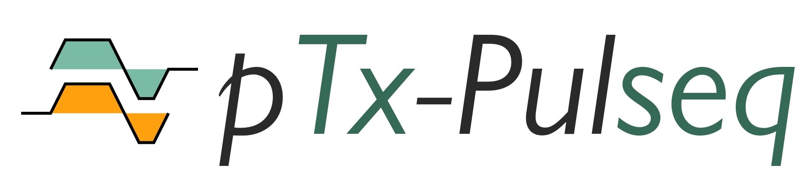

/// html | div.hero
/// html | div.hero__container
/// html | div.hero__title
/// html | div.hero__title.grid
{ .hero__logo }
on
{ .hero__philips }
///
///
/// html | p.hero__subtitle
Run __Pulseq sequences__ directly on __Philips MRI scanners__  
_Advanced sequences made accessible_
///

/// html | div.hero__actions
[:rocket: Get Started](quickstart.md){ .md-button .hero__button .md-button--primary }
[:camera: View Examples](examples.md){ .md-button .hero__button .hero__button--secondary }
///

///
///

/// html | div.universal-title

# __:earth_africa: Pulseq — The Universal MRI Language__

/// html | div.universal-subtitle
_Vendor-neutral sequence development for the global research community_
///
///

__Pulseq__ is an open-source framework that defines MRI sequences in a standardized format,
enabling researchers to share and execute the same sequence across different scanner manufacturers
— Siemens, GE, Philips, United Imaging, and Canon.  
  
Think of it as the "common language" that makes advanced MRI research truly
collaborative and reproducible across institutions worldwide.
  
---
  
> __🔬 The OpenMR Project__{ .project-highlight-title }
>
> _Bringing this powerful capability to Philips MRI scanners_{ .project-highlight-subtitle }
>
> Our interpreter enables researchers to run advanced, vendor-neutral Pulseq sequences directly on Philips MRI scanners  
> No conversions and approximations, just direct execution.
>
  
/// html | div.grid.cards

- :play_pause:{ .lg .middle } __Direct Execution__

    ---

    Scanner update? Never port all your sequences again!  
  
    Pulseq sequences are loaded dynamically

- :handshake:{ .lg .middle } __Cross-Vendor Collaboration__

    ---

    Execute Pulseq sequences from Siemens, GE, United Imaging, and Canon researchers.  
  
    Share innovations and validate them across the globe

- :building_construction:{ .lg .middle } __Build Upon Others__

    ---

    Learn from the many existing examples,  
    or use cutting-edge techniques already standardized in Pulseq

///

## What's next?

[:rocket: Quickstart Guide](quickstart.md){ .md-button .md-button--primary }
[:camera: View Examples](examples.md){ .md-button .md-button--secondary }
[:arrow_right: Features](features.md){ .md-button }
[:globe_with_meridians: Community & Contact](community-contact.md){ .md-button }
