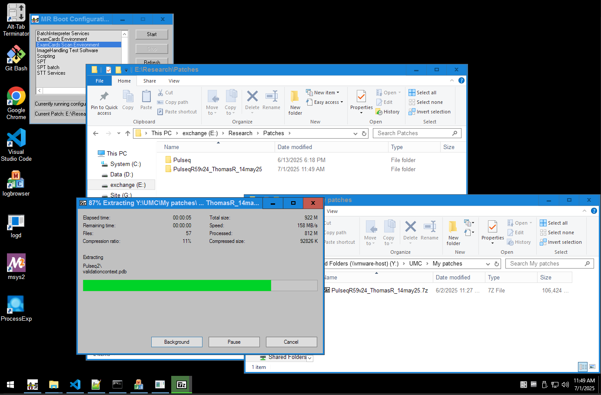
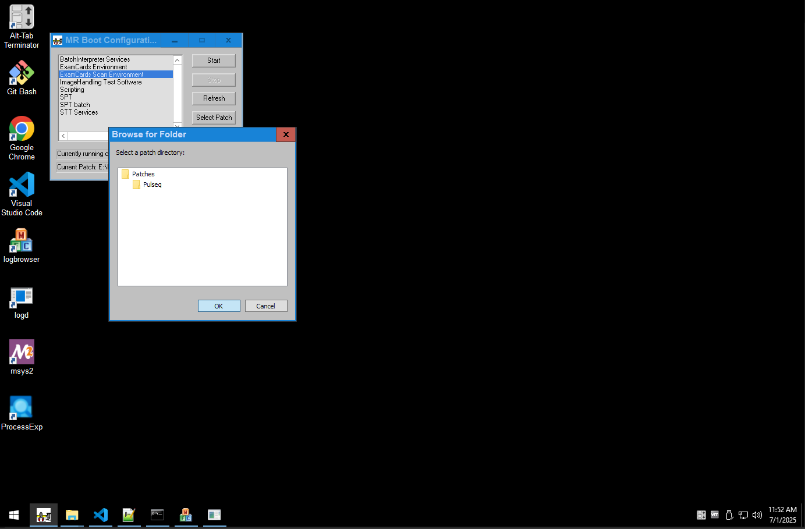
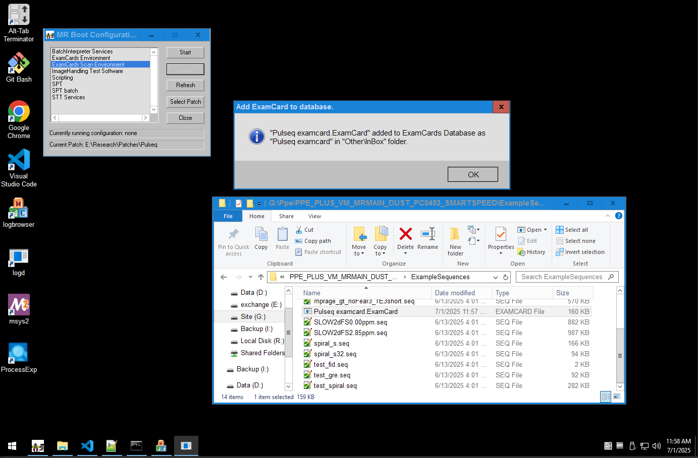
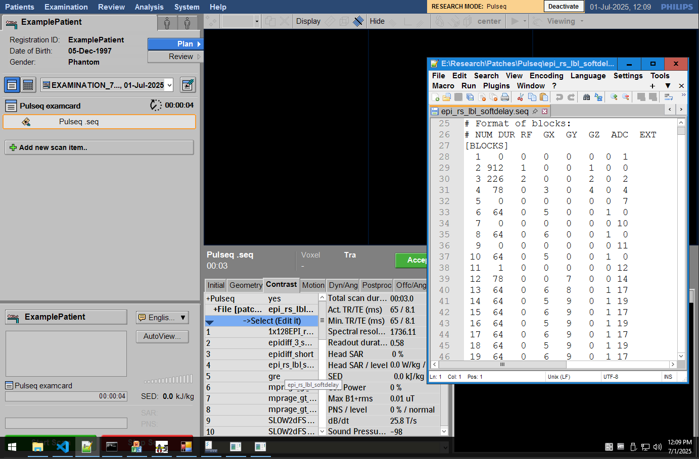
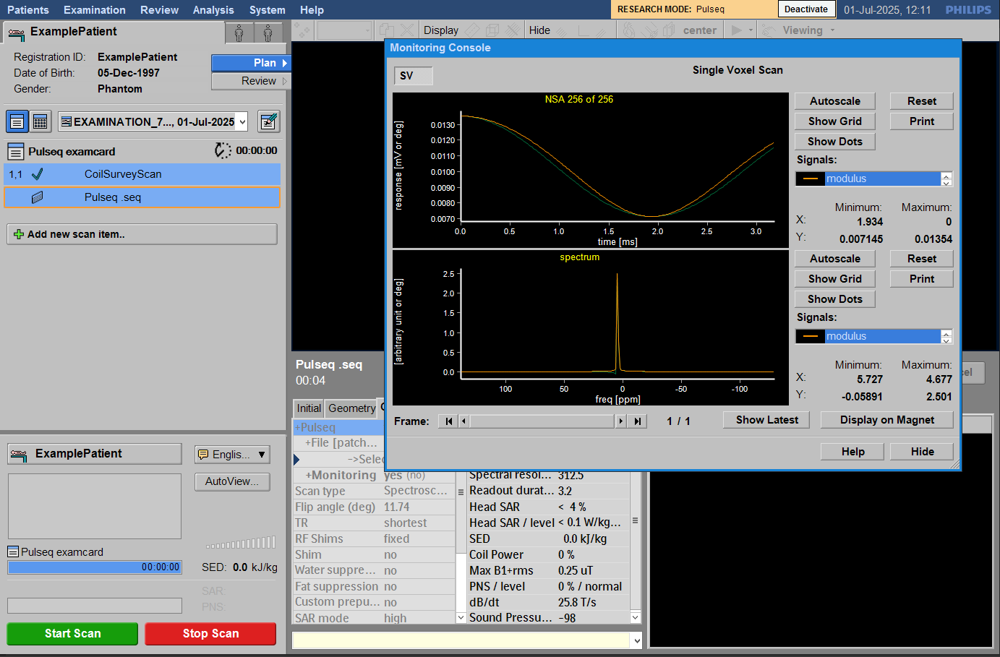

# Quickstart Guide

> Get up and running with Pulseq on Philips in three simple steps.

## Prerequisites

Before you begin, ensure you have:

1. :scroll: __Philips research agreement__ including:
    i. :computer: __Pulse programming environment (PPE)__ VM or direct scanner access
    i. :key: __Clinical Science Keys (CSK's)__ enabling patches on the scanner
    i. :people_holding_hands: __MR-Paradise__ access to the forum and private GitHub repository
2. :brain: __Basic familiarity__ with _Pulseq_ & _Philips_ development
    i. New to _Pulseq_? Check out the [:octicons-arrow-right-24: Pulseq Tutorials](https://pulseq.github.io/tutorials.html)
    i. New to _Philips_? There are courses provided by _Philips_ and [:octicons-arrow-right-24: Gyrotools](https://gyrotools.com/gt/index.php/courses/courses)
3. :snake: __Python__ or :octicons-code-24: __MATLAB__ environment for creating sequences

/// admonition | No MATLAB or Python?
    type: tip

You can still follow along by downloading the example `.seq` files directly, or by using an online environment:  
[](https://mybinder.org/v2/gh/pulseq/pulseq-examples/HEAD)
///

---

## Step 1: Get a Sequence File

You can either download a pre-made sequence file or create your own:

/// html | div.grid.cards

- :arrow_down:{ .lg .middle } __Download an Example__

    ---

    Start with one of our validated examples.  
    [:octicons-arrow-right-24: View Examples](examples.md)

- :pencil:{ .lg .middle } __Create Your Own__

    ---

    Use PyPulseq or MATLAB to design a sequence.  
    [:octicons-arrow-right-24: Pulseq Tutorials](https://pulseq.github.io/tutorials.html)

///

### Minimal Example

Here's a simple Gradient Echo (GRE) sequence to get you started.

/// html | div.scroll16
/// tab | Python code

```python
import math

import numpy as np

import pypulseq as pp


def main(plot: bool = False, write_seq: bool = False, seq_filename: str = 'gre_pypulseq.seq'):
    # ======
    # SETUP
    # ======
    # Create a new sequence object
    fov = 256e-3  # Define FOV and resolution
    Nx = 64
    Ny = 64
    alpha = 10  # flip angle
    slice_thickness = 3e-3  # slice
    TR = 12e-3  # Repetition time
    TE = 5e-3  # Echo time

    rf_spoiling_inc = 117  # RF spoiling increment

    system = pp.Opts(
        max_grad=28,
        grad_unit='mT/m',
        max_slew=150,
        slew_unit='T/m/s',
        rf_ringdown_time=20e-6,
        rf_dead_time=100e-6,
        adc_dead_time=10e-6,
    )

    seq = pp.Sequence(system)

    # ======
    # CREATE EVENTS
    # ======
    rf, gz, _ = pp.make_sinc_pulse(
        flip_angle=alpha * math.pi / 180,
        duration=3e-3,
        slice_thickness=slice_thickness,
        apodization=0.42,
        time_bw_product=4,
        system=system,
        return_gz=True,
        delay=system.rf_dead_time,
    )
    # Define other gradients and ADC events
    delta_k = 1 / fov
    gx = pp.make_trapezoid(channel='x', flat_area=Nx * delta_k, flat_time=3.2e-3, system=system)
    adc = pp.make_adc(num_samples=Nx, duration=gx.flat_time, delay=gx.rise_time, system=system)
    gx_pre = pp.make_trapezoid(channel='x', area=-gx.area / 2, duration=1e-3, system=system)
    gz_reph = pp.make_trapezoid(channel='z', area=-gz.area / 2, duration=1e-3, system=system)
    phase_areas = (np.arange(Ny) - Ny / 2) * delta_k

    # gradient spoiling
    gx_spoil = pp.make_trapezoid(channel='x', area=2 * Nx * delta_k, system=system)
    gz_spoil = pp.make_trapezoid(channel='z', area=4 / slice_thickness, system=system)

    # Calculate timing
    delay_TE = (
        math.ceil(
            (
                TE
                - (pp.calc_duration(gz, rf) - pp.calc_rf_center(rf)[0] - rf.delay)
                - pp.calc_duration(gx_pre)
                - pp.calc_duration(gx) / 2
                - pp.eps
            )
            / seq.grad_raster_time
        )
        * seq.grad_raster_time
    )
    delay_TR = (
        np.ceil(
            (TR - pp.calc_duration(gz, rf) - pp.calc_duration(gx_pre) - pp.calc_duration(gx) - delay_TE)
            / seq.grad_raster_time
        )
        * seq.grad_raster_time
    )

    assert np.all(delay_TE >= 0)
    assert np.all(delay_TR >= pp.calc_duration(gx_spoil, gz_spoil))

    rf_phase = 0
    rf_inc = 0

    # ======
    # CONSTRUCT SEQUENCE
    # ======
    # Loop over phase encodes and define sequence blocks
    for i in range(Ny):
        rf.phase_offset = rf_phase / 180 * np.pi
        adc.phase_offset = rf_phase / 180 * np.pi
        rf_inc = divmod(rf_inc + rf_spoiling_inc, 360.0)[1]
        rf_phase = divmod(rf_phase + rf_inc, 360.0)[1]

        seq.add_block(rf, gz)
        gy_pre = pp.make_trapezoid(
            channel='y',
            area=phase_areas[i],
            duration=pp.calc_duration(gx_pre),
            system=system,
        )
        seq.add_block(gx_pre, gy_pre, gz_reph)
        seq.add_block(pp.make_delay(delay_TE))
        seq.add_block(gx, adc)
        gy_pre.amplitude = -gy_pre.amplitude
        seq.add_block(pp.make_delay(delay_TR), gx_spoil, gy_pre, gz_spoil)

    # Check whether the timing of the sequence is correct
    ok, error_report = seq.check_timing()
    if ok:
        print('Timing check passed successfully')
    else:
        print('Timing check failed. Error listing follows:')
        [print(e) for e in error_report]

    # ======
    # VISUALIZATION
    # ======
    if plot:
        seq.plot()

    seq.calculate_kspace()

    # Very optional slow step, but useful for testing during development e.g. for the real TE, TR or for staying within
    # slew-rate limits
    rep = seq.test_report()
    print(rep)

    # =========
    # WRITE .SEQ
    # =========
    if write_seq:
        # Prepare the sequence output for the scanner
        seq.set_definition(key='FOV', value=[fov, fov, slice_thickness])
        seq.set_definition(key='Name', value='gre')

        seq.write(seq_filename)

    return seq


if __name__ == '__main__':
    main(plot=False, write_seq=True)
```

///
/// tab | MATLAB code

```matlab
% set system limits
sys = mr.opts('MaxGrad', 22, 'GradUnit', 'mT/m', ...
    'MaxSlew', 120, 'SlewUnit', 'T/m/s', ... 
    'rfRingdownTime', 20e-6, 'rfDeadTime', 100e-6, 'adcDeadTime', 10e-6);

seq=mr.Sequence(sys);           % Create a new sequence object
fov=256e-3; Nx=128; Ny=Nx;      % Define FOV and resolution
alpha=10;                       % flip angle
sliceThickness=3e-3;            % slice
TR=12e-3;                       % repetition time TR
TE=5e-3;                        % echo time TE  
%TE=[7.38 9.84]*1e-3;            % alternatively give a vector here to have multiple TEs (e.g. for field mapping)

% more in-depth parameters
rfSpoilingInc=117;              % RF spoiling increment
roDuration=3.2e-3;              % ADC duration

% Create fat-sat pulse 
% (in Siemens interpreter from January 2019 duration is limited to 8.192 ms, and although product EPI uses 10.24 ms, 8 ms seems to be sufficient)
% B0=2.89; % 1.5 2.89 3.0
% sat_ppm=-3.45;
% sat_freq=sat_ppm*1e-6*B0*lims.gamma;
% rf_fs = mr.makeGaussPulse(110*pi/180,'system',lims,'Duration',8e-3,...
%     'bandwidth',abs(sat_freq),'freqOffset',sat_freq);
% gz_fs = mr.makeTrapezoid('z',sys,'delay',mr.calcDuration(rf_fs),'Area',1/1e-4); % spoil up to 0.1mm

% Create alpha-degree slice selection pulse and gradient
[rf, gz] = mr.makeSincPulse(alpha*pi/180,sys,'Duration',3e-3,...
    'SliceThickness',sliceThickness,'apodization',0.42,'timeBwProduct',4,...
    'use','excitation');

% Define other gradients and ADC events
deltak=1/fov;
gx = mr.makeTrapezoid('x',sys,'FlatArea',Nx*deltak,'FlatTime',roDuration);
adc = mr.makeAdc(Nx,sys,'Duration',gx.flatTime,'Delay',gx.riseTime);
gxPre = mr.makeTrapezoid('x',sys,'Area',-gx.area/2,'Duration',1e-3);
gzReph = mr.makeTrapezoid('z',sys,'Area',-gz.area/2,'Duration',1e-3);
phaseAreas = ((0:Ny-1)-Ny/2)*deltak;
gyPre = mr.makeTrapezoid('y',sys,'Area',max(abs(phaseAreas)),'Duration',mr.calcDuration(gxPre));
peScales=phaseAreas/gyPre.area;
        

% gradient spoiling
gxSpoil=mr.makeTrapezoid('x',sys,'Area',2*Nx*deltak);
gzSpoil=mr.makeTrapezoid('z',sys,'Area',4/sliceThickness);

% Calculate timing
delayTE=ceil((TE - mr.calcDuration(gxPre) - gz.fallTime - gz.flatTime/2 ...
    - mr.calcDuration(gx)/2)/seq.gradRasterTime)*seq.gradRasterTime;
delayTR=ceil((TR - mr.calcDuration(gz) - mr.calcDuration(gxPre) ...
    - mr.calcDuration(gx) - delayTE)/seq.gradRasterTime)*seq.gradRasterTime;
assert(all(delayTE>=0));
assert(all(delayTR>=mr.calcDuration(gxSpoil,gzSpoil)));

rf_phase=0;
rf_inc=0;

% Loop over phase encodes and define sequence blocks
for i=1:Ny
    for c=1:length(TE)
        %seq.addBlock(rf_fs,gz_fs); % fat-sat
        rf.phaseOffset=rf_phase/180*pi;
        adc.phaseOffset=rf_phase/180*pi;
        rf_inc=mod(rf_inc+rfSpoilingInc, 360.0);
        rf_phase=mod(rf_phase+rf_inc, 360.0);
        %
        seq.addBlock(rf,gz);
        seq.addBlock(gxPre,mr.scaleGrad(gyPre,peScales(i)),gzReph);
        seq.addBlock(mr.makeDelay(delayTE(c)));
        seq.addBlock(gx,adc);
        %gyPre.amplitude=-gyPre.amplitude;
        seq.addBlock(mr.makeDelay(delayTR(c)),gxSpoil,mr.scaleGrad(gyPre,-peScales(i)),gzSpoil)
    end
end

%% check whether the timing of the sequence is correct
[ok, error_report]=seq.checkTiming;

if (ok)
    fprintf('Timing check passed successfully\n');
else
    fprintf('Timing check failed! Error listing follows:\n');
    fprintf([error_report{:}]);
    fprintf('\n');
end

%% prepare sequence export
seq.setDefinition('FOV', [fov fov sliceThickness]);
seq.setDefinition('Name', 'gre');

seq.write('gre.seq')       % Write to pulseq file
```

///
///

---

## Step 2: Install the Interpreter

The interpreter is a Philips patch that you need to build and install.  
___The details on this process are available in the [:octicons-arrow-right-24: private GitHub repository](https://github.com/philips-internal/MRParadisePulseq)___

/// details | Research patches
The Pulseq interpreter is a patch, like any other. Patches can be wonderful, and might bring great features to your scanner.  
However this patch, like others, is not made by Philips.
You need to build the patch yourself, and you are responsible for its validation and usage.
///

### Build and Install overview

1. __Get the code__ by adding the private [GitHub repository](https://github.com/philips-internal/MRParadisePulseq) as a new remote
    i. __Checkout__ the interpreter branch if it is available for your scanner's relase
    ii. If needed __merge__ the code, into your own custom patch or branch
2. __Compile__ the code into a __patch__
3. __Test__ the patch and your `.seq` files in the __simulator__
4. All okay? Copy over and __enjoy__ the interpreter on your scanner! :tada:

More detailed instructions are available in the repository's `README`.

---

## Step 3: Run Your Sequence

/// tab | Copy patch
__Copy over (and uncompress if needed) the patch folder, to the scanner's patch directory__



///
/// tab | Activate patch
__Activate the patch, for example, using the MR Boot Configuration window__



///
/// tab | Import Examcard
__Double click on the `.ExamCard` file provided with the patch source code, to load it into the scanner's database__



///
/// tab | Select sequence
__Open the _"Pulseq .seq"_ scan, and select the sequence file (in the `patch` directory) to run__



///
/// tab | Run sequence
__Hit "Start Scan" to run your sequence!__



///

---

## Next Steps

Now that you're set up, explore what else is possible:

/// html | div.grid.cards

- :rocket:{ .lg .middle } __Advanced Features__

    ---

    Discover hybrid mode, pTx support, and more.  
    [:octicons-arrow-right-24: See Features](features.md)

- :camera:{ .lg .middle } __More Examples__

    ---

    Browse complex sequences like EPI and Spiral.  
    [:octicons-arrow-right-24: View Examples](examples.md)

- :people_holding_hands:{ .lg .middle } __Join the Community__

    ---

    Get help, contribute, and connect with other users.  
    [:octicons-arrow-right-24: Get in touch](community-contact.md)

///

---

## How to Cite

If you use our Pulseq Interpreter in your research, please cite our work:

### BibTeX Citation

```bibtex
@article{Roos2025,
  title = {pTx-Pulseq in hybrid sequences: Accessible \& advanced hybrid open-source MRI sequences on Philips scanners},
  author = {Thomas H. M. Roos and Edwin Versteeg and Mark Gosselink and Hans Hoogduin and 
            Kyung Min Nam and Nicolas Boulant and Vincent Gras and Franck Mauconduit and 
            Dennis W. J. Klomp and Jeroen C. W. Siero and Jannie P. Wijnen},
  journal = {Magnetic Resonance in Medicine},
  year = {2025},
  pages = {1--17},
  doi = {10.1002/mrm.30601}
}
```

### APA Style

Roos, T., Versteeg, E., Gosselink, M., Hoogduin, H., Nam, K., Boulant, N., Gras, V., Mauconduit,
F., Klomp, D., Siero, J. C. W., & Wijnen, J. (2025).  
pTx-Pulseq in hybrid sequences: Accessible & advanced hybrid open-source MRI sequences on Philips scanners.  
*Magnetic Resonance in Medicine*, 1, 1–17.  
<https://doi.org/10.1002/mrm.30601>
